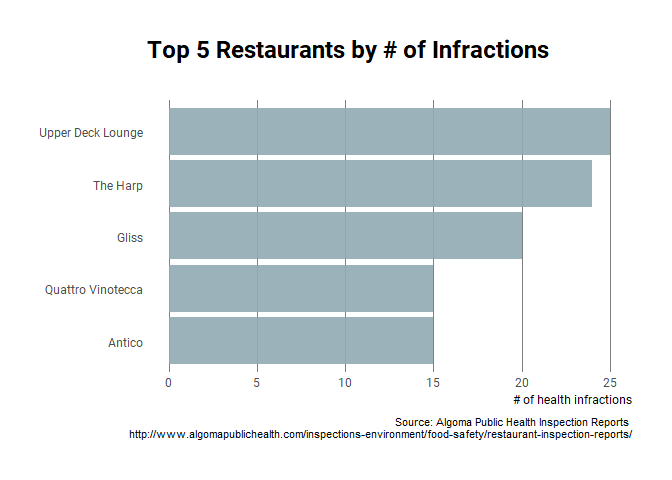
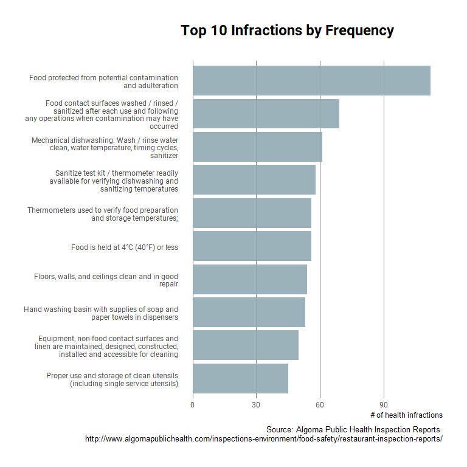

```{r setup, include=FALSE}
knitr::opts_chunk$set(echo = TRUE)
```

[Algoma Public Health](http://www.algomapublichealth.com/) is the public health agency in my area that inspects restaurants to ensure they are abiding by all the relevant food safety legislation. They are also nice enough to publish their [restaurant health inspection reports](http://www.algomapublichealth.com/inspections-environment/food-safety/restaurant-inspection-reports/) online for anyone to review.

I searched for a few restaurants that I frequent (phew [Fratellis](https://goo.gl/maps/rqj5goqwqeT2) is safe!) but then I wanted to know **which restaurants had the most health infractions?**

Their website isn't setup to answer that kind of question. Each inspection report is published as a unique page on their website which makes aggregating and comparing difficult.

I used `rvest` to scrape the URLs of all the reports APH published. Then I scraped the contents of the reports so that I could create a dataset that would allow me to aggregate and compare the results (the dataset and code [available here](https://github.com/colemanrob/restoscrape/tree/master/data).)

Restaurants with the most infractions
-------------------------------------

Of the 90% of restaurants who received three visits, here are the top 5 in terms of total number of infractions:



Surprising results. Upper Deck has some [particularly bad](http://www.algomapublichealth.com/inspections-environment/food-safety/restaurant-inspection-reports/?id=7e880c25-6cd5-4e01-bcf4-7ad707ae166f) health infractions.

But that got me thinking--not all infractions are equal. Some are minor and are corrected onsite. Some are more serious and others still are downright strange. Let's take a closer look.

Number of infractions
---------------------

Here are the top 10 infractions by frequency, meaning these infractions appear most often in the dataset.



Stranger Infractions
-------------------

The infractions that don't appear frequently are also quite interesting. Here are infractions that only appear once in the dataset, but leave me with more questions than answers.

| Restaurant                               | Address                  | Date       | Infraction                                                                                                                 |
|:-----------------------------------------|:-------------------------|:-----------|:---------------------------------------------------------------------------------------------------------------------------|
| Juicy Beatz & Healthy Eatz               | 235 McNabb Street        | 2017-08-23 | Food handler hygiene                                                                                                       |
| Pauline's Place                          | 923 Queen Street         | 2017-11-28 | Only Grade A or B eggs permitted                                                                                           |
| Queen West Variety                       | 602 Queen Street         | 2016-12-16 | Exclusion of live animals on the premises, subject to exemptions                                                           |
| Roberta Bondar Pavilion Serving Kitchens | 65 Foster Dr             | 2016-08-30 | No room with food used for sleeping purposes                                                                               |
| Teen Challenge Kitchen                   | 1446 Great Northern Road | 2016-12-13 | Uninspected meats obtained through hunting: only for custom cutting, wash/rinse/sanitize equipment after use as prescribed |

Questions that come to mind:

-   who's sleeping in the Pavilion?
-   did the Teen Challenge involve catching your meal?
-   what kind of animals are hanging out in Queen West Variety?
-   how does one tell the grade of eggs? Can you do it just by looking?

What does this data tell us? Not too much really :)

I hope you enjoyed this peek behind the health inspection curtain. The dataset and code are [available here](https://github.com/colemanrob/restoscrape/tree/master/data). If you have any questions or comments, please feel free to [get in touch](https://twitter.com/coleman).
