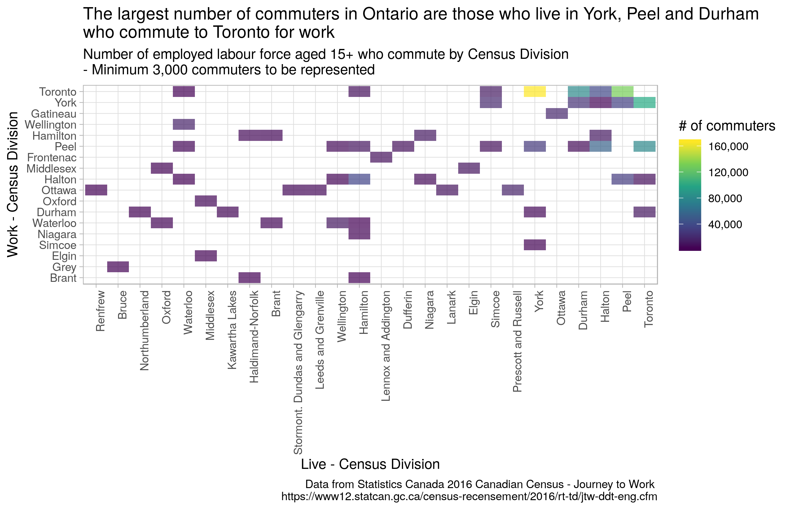
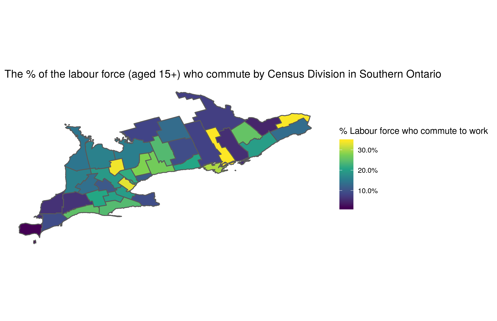

```{r setup, include=FALSE}
knitr::opts_chunk$set(echo = TRUE)
```


I was inspired by [David Robinson](http://varianceexplained.org/)'s latest webcast in which he made a heatmap of French train delays using `geom_tile` and wanted to try it out for myself.  

<blockquote class="twitter-tweet"><p lang="en" dir="ltr">In this week&#39;s <a href="https://twitter.com/hashtag/tidytuesday?src=hash&amp;ref_src=twsrc%5Etfw">#tidytuesday</a> screencast, I analyze delays in French train stations 🇫🇷🚄<br><br>I show how to create heatmaps of delays (inspired by <a href="https://twitter.com/noccaea?ref_src=twsrc%5Etfw">@noccaea</a>!), and embarrass myself with even the simplest French pronunciations<a href="https://t.co/zBrkIkdcCz">https://t.co/zBrkIkdcCz</a> <a href="https://twitter.com/hashtag/rstats?src=hash&amp;ref_src=twsrc%5Etfw">#rstats</a> <a href="https://t.co/RI7ZpxV89X">pic.twitter.com/RI7ZpxV89X</a></p>&mdash; David Robinson (@drob) <a href="https://twitter.com/drob/status/1100456189752688640?ref_src=twsrc%5Etfw">February 26, 2019</a></blockquote> <script async src="https://platform.twitter.com/widgets.js" charset="utf-8"></script>

I don't have a lot of opportunities to use heatmaps, but recently Statcan has released their [Journey to Work](https://www12.statcan.gc.ca/census-recensement/2016/rt-td/jtw-ddt-eng.cfm) data as part of the 2016 Census.  I wanted to see if I could use a heatmap to understand the commuting patterns in communities in southern Ontario.  

### Load packages


``` r
library(tidyverse)
library(cancensus)
```

I downloaded the [commuting table](https://www12.statcan.gc.ca/census-recensement/2016/dp-pd/dt-td/Rp-eng.cfm?LANG=E&APATH=3&DETAIL=0&DIM=0&FL=A&FREE=0&GC=0&GID=0&GK=0&GRP=1&PID=113344&PRID=10&PTYPE=109445&S=0&SHOWALL=0&SUB=0&Temporal=2017&THEME=125&VID=0&VNAMEE=&VNAMEF=) from statscan because I couldn't find it using the `cancensus` package.

``` r
raw_commute <- read_csv("~/projects/R stuff/commute/98-400-X2016391_English_CSV_data.csv") %>% 
    janitor::clean_names() %>% 
    select(code = geo_code_por,
           live = geo_name,
           work = geo_name_1,
           total = dim_sex_3_member_id_1_total_sex)
```


``` r
# filter only those whose code starts w/ 35 (Ontario)
ontario_commute <- raw_commute %>% 
    filter(str_detect(code, pattern = "^35")) 
```

### Download geography data

I was able to retrieve the working age population and census division geographies using `cancensus`

``` r
library(cancensus)
library(sf)
```

    ## Linking to GEOS 3.7.0, GDAL 2.3.2, PROJ 5.2.0

``` r
# create list of ontario census divisions to pass to cancensus
regions_list_ontario <- list_census_regions("CA16") %>% 
  filter(str_detect(region, pattern = "^35"))  %>% 
  as_census_region_list
```

    ## Querying CensusMapper API for regions data...

``` r
pop_data <- get_census("CA16",
                           regions = regions_list_ontario,
                           vectors = "v_CA16_61",
                           level = "CD",
                       geo_format = "sf", labels = "short") %>% 
  janitor::clean_names()
```


``` r
# clean
pop_data %>% 
  mutate(working_age = v_ca16_61) %>% 
  mutate(code = as.double(geo_uid)) %>% 
  select(code, working_age, shape_area, geometry) -> pop_data_clean
```

### Joining the tables together

``` r
# remove commuting within cd, compute totals
ontario_commute %>% 
  filter(live != work) %>%
  group_by(live) %>% 
  mutate(total_commuters = sum(total),
         prop_commuters = total / total_commuters ) %>% 
  ungroup() %>% 
  left_join(pop_data_clean, by = "code") %>% 
  group_by(work) %>% 
  mutate(total_commuters_destination = sum(total)) %>% 
  mutate(live_prop = total_commuters / working_age,
         work_prop = total / working_age ) %>% 
  ungroup() -> ontario_commute_clean
```

### Create visualizations

Let's see what visualizations will work.

``` r
ontario_commute_clean %>% 
    filter(total >= 3000) %>% 
    mutate(live = str_wrap(live, width = 15)) %>% 
    mutate(live = fct_reorder(live, total)) %>% 
    mutate(work = fct_reorder(work, total)) %>% 
    ggplot(aes(live, work, fill = total)) +
    geom_tile(alpha = 0.7) +
    theme_light() +
    theme(axis.text.x = element_text(angle = 90, hjust = 1)) +
    scale_fill_viridis_c(labels = scales::comma_format()) +
    labs(fill = "# of commuters",
         title = "The largest number of commuters in Ontario are those who live in York, Peel and Durham who commute to Toronto for work",
         subtitle = "Number of employed labour force aged 15+ who commute by Census Division - Minimum 3,000 commuters to be represented",
         x = "Live - Census Division",
         y = "Work - Census Division",
         caption = "Data from Statistics Canada 2016 Canadian Census - Journey to Work \n https://www12.statcan.gc.ca/census-recensement/2016/rt-td/jtw-ddt-eng.cfm")
```



### Map the proportions

I'm always trying to improve my mapping skills and `geom_sf` makes it a lot easier.


``` r
ontario_commute_clean %>% 
  filter((!live %in% c("Rainy River", "Kenora", "Thunder Bay", "Algoma", "Nipissing", 
                       "Cochrane", "Greater Sudbury / Grand Sudbury", "Manitoulin",
                       "Timiskaming", "Sudbury", "Parry Sound"))) %>% 
  ggplot() +
  geom_sf(aes(fill = live_prop)) +
  scale_fill_viridis_c("% Labour force who commute to work", labels = scales::percent) + theme_minimal() +
  theme(panel.grid = element_blank(),
        axis.text = element_blank(),
        axis.ticks = element_blank()) + 
  coord_sf(datum=NA) +
  labs(title = "The % of the labour force (aged 15+) who commute by Census Division in Southern Ontario")
```


