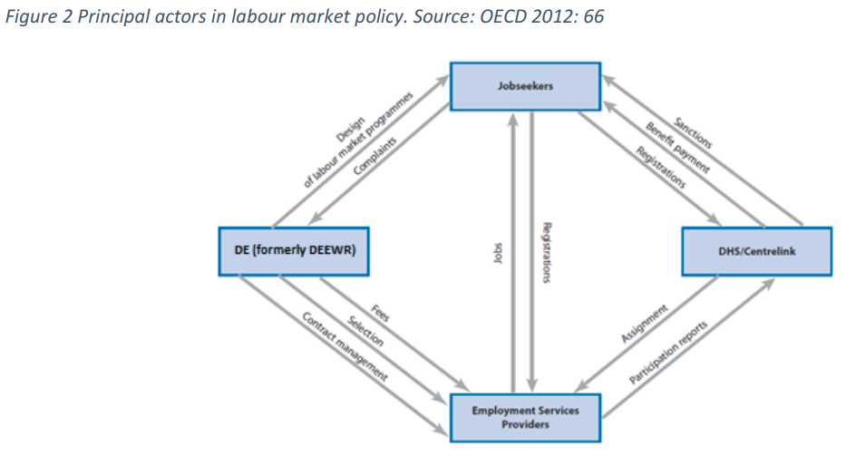

```{r setup, include=FALSE}
knitr::opts_chunk$set(echo = FALSE)
```


## Moral hazard in ALMPs

* [@bruttelContractingoutGovernanceMechanisms2005] reviews the mechanisms by which government can manage the risks (moral hazard) associated with contracting out of ALMPs using a [principal-agent theory](https://en.wikipedia.org/wiki/Principal%E2%80%93agent_problem) lens.
* the author solves for the risks by advancing an integrated governance approach using 3 distinct governance mechanisms
  *	incentives
  *	information
  *	control 
* reviews 3 countries (UK, Netherlands, Australia)

### Principal-agent theory and moral hazard
* concerned with how does govt (principal) ensure that service providers (agents) act in the govts interest 
* main risk is _moral hazard_ where agents act in their own interest (maximising utility, risk avoidance etc) where principal cannot observe their actions
* moral hazard in ALMPs revolve around 3 key areas:
   * creaming - selecting only optimal clients for service
   * parking - not serving clients with low success probability
   * dead-weight - serving clients who would have otherwise been successful without intervention (not explicitly mentioned but described elsewhere)

### 1. Incentive mechanisms
* outcomes-based payments
* split-fee works best (fixed & outcomes) rather than threshold based (like US) so that award function is linear
* measured as outputs (outcomes at 13 and 26 weeks are standard) rather than inputs (clients served)
* should optimize around under-investment i.e. skills training like Job Seeker Account (matching govt investment)
* common strategy to avoid moral hazard problems is to organize outcomes payments by client groups based on assessment tool (e.g. JSCI in AUS and Kansmeter in Netherlands)

### 2. Information mechanisms
* benchmarking - measure relative performance of providers
	* 2 types of variables:  context (regional/local labour market) and jobseeker characteristics (age, duration of unemployment, skills etc)
	* Australia 5 Star model gold standard - best 60% of providers are offered contract renewal without tender
* monitoring - mix of database inputs and in-person
	* overcome blackbox problem
	* irregularities flagged automatically

### 3. Control mechanisms
* rules and regulations (guidelines, eligibility, etc)
* quality management frameworks
	* set minimum standard of service
* tied to monitoring and benchmarking

### Special expertise 
* identifies 3 types of capacities governments need
	* feasibility assessment capacity - _make-or-buy_ decisions about services
	* Implementation capacity (*incentive mechanisms*) tenders, selecting providers, negotiate contracts etc
	* evaluation capacity (*information and control*) - evaluate and monitor the performance of providers
	
### Highlights

> "which governance mechanisms are most suitable for the contracting-out of public employment services" ([Bruttel :46](zotero://open-pdf/library/items/RNB8PZVJ?page=9))

> "incentives, information, and control" ([Bruttel :46](zotero://open-pdf/library/items/RNB8PZVJ?page=9))

> "incentives focus mainly on the optimal design of payment structures, information mechanisms usually make use of performance benchmarking and monitoring to increase the public purchaser's knowledge about the private providers" ([Bruttel :46](zotero://open-pdf/library/items/RNB8PZVJ?page=9))

> "First" - "control mechanisms are defined as extensive rules and regulations that state in great detail how providers have to deliver their services." ([Bruttel :46](zotero://open-pdf/library/items/RNB8PZVJ?page=9))

> "Second" - "Principal-agent theory" - "Its main focus is on the dilemma of how to make an agent (e.g. an employee or contractor) act in the interest of the principal (e.g. an employer or purchaser)" ([Bruttel :47](zotero://open-pdf/library/items/RNB8PZVJ?page=10))

> "public purchaser is unable to observe the actions that a contracted private provider undertakes" - "developing governance structures that allow for a solution or at least an attenuation of this trade-off" ([Bruttel :48](zotero://open-pdf/library/items/RNB8PZVJ?page=11))

> "moral hazard" - "agents which maximize their own utility to the detriment of that of the principal in situations in which their actions cannot be fully observed" ([Bruttel :48](zotero://open-pdf/library/items/RNB8PZVJ?page=11))

> "three" - "incentive mechanisms" - "performance-based payments" ([Bruttel :48](zotero://open-pdf/library/items/RNB8PZVJ?page=11))

> "the deficiencies of past contracting arrangements often were due to a reliance on one mechanism and a failure to understand the interdependence of all three" ([Bruttel :49](zotero://open-pdf/library/items/RNB8PZVJ?page=12))

> "Employment Service Areas" ([Bruttel :50](zotero://open-pdf/library/items/RNB8PZVJ?page=13))

> "selection of providers is based on two criteria: the capacity to deliver services (40%) and the capacity to achieve outcomes (60%). The capacity to deliver services is mainly an input-related factor" ([Bruttel :50](zotero://open-pdf/library/items/RNB8PZVJ?page=13))

> "the capacity to achieve outcome is mainly a quantitative factor that takes into account past performance" ([Bruttel :50](zotero://open-pdf/library/items/RNB8PZVJ?page=13))

> "providers have a Job Seeker Account at their disposal, which is a budget that varies according to the status of "highly disadvantaged" and locational disadvantage and includes up to $1,150 for the first ISca period and up to $639 for the second ISca period, which starts after 24 months of unemploymen" ([Bruttel :51](zotero://open-pdf/library/items/RNB8PZVJ?page=14))

> "there is a training account of up to $584 which is available for older jobseekers and indigenous jobseekers" ([Bruttel :51](zotero://open-pdf/library/items/RNB8PZVJ?page=14))

> "Because the public vacancy database depends exclusively on input from the providers (and employers), providers are paid a job placement fee (up to $401) if a jobseeker is placed in a vacancy that was listed on the national vacancy database by the provider." ([Bruttel :51](zotero://open-pdf/library/items/RNB8PZVJ?page=14))

> "outcome-related payments are the single most important governance mechanism to align the interests of the private providers with those of the public purchaser" - "Thus, providers face constant marginal incentives because the award function is linear, like that in a piece-rate compensation function" ([Bruttel :54](zotero://open-pdf/library/items/RNB8PZVJ?page=17))

> "the trade-off between optimal incentive contracts and the risk aversion of the providers" - "Former indicators for controlling were often related to inputs" ([Bruttel :56](zotero://open-pdf/library/items/RNB8PZVJ?page=19))

> **"Employment durations of 13 and 26 weeks have emerged internationally as major milestones because they are useful indicators"** ([Bruttel :56](zotero://open-pdf/library/items/RNB8PZVJ?page=19))

> "Hence, the greater their contribution to the placement of a jobseeker; the higher their payment should be. However, it is very difficult to measure the net impact of treatment on an individual client." - "However, by only taking into account the gross results, the government implicitly assumes that the impact is constant for all jobseekers." ([Bruttel :58](zotero://open-pdf/library/items/RNB8PZVJ?page=21))

> **"differentiate payments according to target groups"** ([Bruttel :58](zotero://open-pdf/library/items/RNB8PZVJ?page=21))

> "Kansmeter" ([Bruttel :58](zotero://open-pdf/library/items/RNB8PZVJ?page=21))

> "Major problems are that clients do not reveal their true situation because benefit assessment and profiling are carried out in the same interview, and that the time frame is too limited" - "there is also a structural problem in that the target groups are defined very broadly and in many cases are not optimally linked to the profiling instruments" ([Bruttel :58](zotero://open-pdf/library/items/RNB8PZVJ?page=21))

> "Following this assessment, the number of monitoring visits is fixed and may vary from one per year to up to four and more if it is a new site from a new provider or if problems have occurred in the past" ([Bruttel :60](zotero://open-pdf/library/items/RNB8PZVJ?page=23))

> "The basic trade-off is between the higher accountability of providers for their outcomes on the one hand and the freedom that they want to have in order to achieve these outcomes given their greater responsibilities" - "(in particular financial responsibilities) on the other hand." ([Bruttel :62](zotero://open-pdf/library/items/RNB8PZVJ?page=25))

## Institutional moral hazard in Australia PES

### Findings

* [@luigjesInstitutionalMoralHazard2015] outlines how Austrialia moved from a _blackbox_ approach to contracting out employment services towards a regime of minimum requirements and monitoring

* reforms of the blackbox approach included:
	* new tendering processes (see above)
	* 5 Star rating system for providers
	* adjustment of provider responsibilities
	* standardization of work process

* relationship between govt & providers has been rocky as flexibility has been reduced

* problems were creaming and parking

* 3 streams of service
	* stream A - job competitive
	* stream B - vocational issues
	* stream C - series non-vocational issues via referral

* Denmark devolved employment services to municipalities
* Work for the Dole targets long term barriered clients in an attempt to overcome parking (re-vamp of JCP?)
* the KPIs, outcomes based model also includes a bonus if referred to training
* outcomes are based on location, stream and expediency (how fast) clients move to outcomes.



