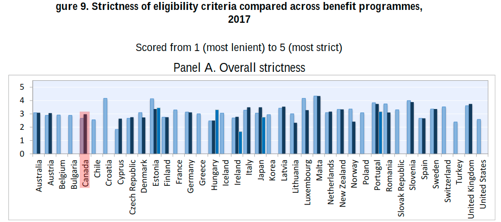

```{r setup, include=FALSE}
knitr::opts_chunk$set(echo = FALSE)
```

## Overview

* Immervol and Knotz [@HowDemandingAre2018] provide a great working paper that evaluates the strictness of rules (eligibility criteria) that govern the receipt of benefits (first-tier/unemployment and second-tier/welfare) across OECD countries
* they establish what types of eligibility criteria are common across countries 
* they surveyed each OECD country and derived a quantitative policy indicator of eligibility strictness of each scheme
* they discuss the impacts of the eligibility choices on first and second tier benefits (for Canada, they used Ontario Works) and marginally discuss administrative provisions (how clients interact with administration)


### Eligibility Criteria
* **entitlement conditions**: these are the rules set by the feds over which Ontario has little influence (e.g. how many hours of work before claim is established)
* **activity conditions** - behavioural requirements that must be met by those who have an established right ('entitlement')
	* availability criteria
		* availability during ALMP participation (excuse for training/participation)
		* occupational mobility - refuse based on NOC/less pay
		* geography
		* other valid reasons - canada only labour dispute
	* job-search and reporting criteria
		* frequency of job-search activity
		* documentation of job-search
	* sanctions for non-compliance
		* voluntary resignation / quit
		* refusal of suitable employment
		* repeated refusal of employment
		* refusal of ALMP participation
		* repeated refusal of ALMP participation
 
### First Tier eligibility criteria
* job search & reporting criteria vary strongly but availability criteria varies little to none
	* australia - job search now once a month and Denmark is entirely online
	* Canada among lowest for job-search and reporting requirements

### Second Tier criteria
* availability criteria represent biggest difference between first and second tier benefit types
* two types of jurisdictions - 1 where SA clients don't qualify (see Germany) and could be Canada and 2 - where rules are mostly identical - see UK's jobseekers allowance
* rules are often less strict here to give local authorities more leeway to design appropriate solutions
	
## Insights
* warnings and sanctions generally are shown to shorten benefit duration and increase re-employment among those who may expect to incur a sanction (threat effects work)
* soft constraints like mandatory participation in AMLPs or gradual reductions of benefits levels over time have similar effects to those of harsher instruments like sanctions and dis-entitlements
* goal is to strengthen incentives to look/prepare for and accept employment and also target those more suitable

## Figures


## Highlights


> "Available meta-evaluations suggest that job-search assistance services and benefit sanctions are effective in yielding positive employment effects, especially if job loss has been relatively recent" ([ 2018:9](zotero://open-pdf/library/items/JHDVJ3JV?page=9))

> "These additional aspects, including how unemployed workers apply for benefits and register for placement, are not commonly considered eligibility criteria. But they nonetheless shape the accessibility of benefits and play an important part in countries' labour-market activation strategie" ([ 2018:10](zotero://open-pdf/library/items/JHDVJ3JV?page=10))

> "for instance, shorter contribution records may be required or participation in ALMPs may generate new rights to unemployment insurance)" ([ 2018:14](zotero://open-pdf/library/items/JHDVJ3JV?page=14))

> "These activity-related eligibility criteria are the subject of this paper and cover (i) requirements to be available for employment, (ii) job-search and reporting requirements, and (iii) sanctions for non-compliance with applicable requirements" ([ 2018:14](zotero://open-pdf/library/items/JHDVJ3JV?page=14))

> "procedural aspects of how jobseekers interact with public authorities when they apply for benefits, register for job placement, arrange meetings, and obtain referrals to job vacancies" ([ 2018:15](zotero://open-pdf/library/items/JHDVJ3JV?page=15))

> "they nonetheless shape the overall activation stance and the accessibility of support for the unemployed. Jobseekers may, for instance, only be able to sign up for unemployment benefits once they have registered for job placement with an employment service provider" ([ 2018:15](zotero://open-pdf/library/items/JHDVJ3JV?page=15))

> "A number of studies have examined the impact of warnings and the existence of sanctions provisions generally and show that they can substantially shorten benefit claim durations and increase re-employment among individuals who may expect to incur a sanction" ([ 2018:18](zotero://open-pdf/library/items/JHDVJ3JV?page=18))

> "More generally, there is evidence that "soft" eligibility constraints like mandatory participation in ALMPs or gradual reductions of benefit levels over time have effects similar to those of harsher instruments like sanctions" ([ 2018:18](zotero://open-pdf/library/items/JHDVJ3JV?page=18))

> "a quantitative policy indicator on the strictness of benefit eligibility using data collected via comprehensive expert surveys" ([ 2018:22](zotero://open-pdf/library/items/JHDVJ3JV?page=22))

> "Enforcement can vary even between countries with the same or very similar rules" ([ 2018:22](zotero://open-pdf/library/items/JHDVJ3JV?page=22))

> "employment is when they participate in ALMPs such as labour market training schemes. For instance, it might be considered more important that claimants complete their courses first rather than having to accept available jobs quickly" ([ 2018:23](zotero://open-pdf/library/items/JHDVJ3JV?page=23))

> "Claimants may be allowed to reject job offers if the vacancy is for an occupation that is different from their last job, or if it pays significantly lower wages." ([ 2018:23](zotero://open-pdf/library/items/JHDVJ3JV?page=23))

> "Claimants may also be required to commute or even relocate in order to acquire and start new employment. Many countries specify a maximum amount of time per day workplace or, alternatively, a maximum distance from their home a claimant can be required to commute to a new job." ([ 2018:23](zotero://open-pdf/library/items/JHDVJ3JV?page=23))

> "Other valid reasons." ([ 2018:23](zotero://open-pdf/library/items/JHDVJ3JV?page=23))

> "Across countries, scores for job-search reporting requirements and sanctions vary relatively strongly" ([ 2018:30](zotero://open-pdf/library/items/JHDVJ3JV?page=30))

> "Australia and Denmark have relaxed job-search requirements." ([ 2018:30](zotero://open-pdf/library/items/JHDVJ3JV?page=30))

> "Denmark, job-search activities are now monitored via an online tool rather than during personal meetings." ([ 2018:30](zotero://open-pdf/library/items/JHDVJ3JV?page=30))

> "France, voluntary unemployment now may result in a complete disqualification from benefit receipt" ([ 2018:31](zotero://open-pdf/library/items/JHDVJ3JV?page=31))

> **"Tighter sanctions now apply for initial and repeated refusals of job offers, as well as for repeated refusals to participate in ALMPs.**" ([ 2018:31](zotero://open-pdf/library/items/JHDVJ3JV?page=31))

> "Canada significantly amended its regulations on suitable work, which now includes relaxed occupational mobility requirements but also additional demands regarding geographical mobility along with a" ([ 2018:31](zotero://open-pdf/library/items/JHDVJ3JV?page=31))

> "shorter list of other valid reasons for refusing a job offer. Overall, this manifests itself in an overall slightly higher score compared to 2014" ([ 2018:32](zotero://open-pdf/library/items/JHDVJ3JV?page=32))

> "In July 2016, Canada replaced the earlier rules, imposing different requirements depending on claimants' unemployment record and contribution payments. The new rules allow claimants to limit their availability to their previous occupation for a 'reasonable period' (not further defined) and at wages and conditions equal to those of their previous jobs" ([ 2018:34](zotero://open-pdf/library/items/JHDVJ3JV?page=34))

> "In Australia, for instance, commuting up to 90 minutes each way is considered suitable" ([ 2018:34](zotero://open-pdf/library/items/JHDVJ3JV?page=34))

> "In Canada, a new definition of suitable work no longer specifies explicit geographic mobility requirements (instead, in determining whether and how far unemployed workers can be expected to commute, claimant's health and physical capabilities are to be considered)" ([ 2018:34](zotero://open-pdf/library/items/JHDVJ3JV?page=34))

> "Canada and Denmark amended their list of valid reasons for refusing employment offers since 2014. In Canada, the list of valid reasons was condensed to one (if the prospective employer is affected by industrial disputes). The score assigned to Canada was lifted to a 5 accordingly." ([ 2018:35](zotero://open-pdf/library/items/JHDVJ3JV?page=35))

> "lower-tier benefit programmes" ([ 2018:44](zotero://open-pdf/library/items/JHDVJ3JV?page=44))

> "focuses on the main differences of eligibility criteria between 1st-tier and lower-tier benefits, and highlights salient features of eligibility rules for lower-tier benefits in selected countries" ([ 2018:44](zotero://open-pdf/library/items/JHDVJ3JV?page=44))

> "do not always require claimants to be available for employment as not all claimants of assistance benefits may in fact be expected to take up employment." ([ 2018:44](zotero://open-pdf/library/items/JHDVJ3JV?page=44))

> "that a clear majority of 25 countries requires lower-tier claimants to be available for employment" ([ 2018:44](zotero://open-pdf/library/items/JHDVJ3JV?page=44))

> "comparing the strictness of "demanding" elements built into unemployment benefits across countries and over time" ([ 2018:49](zotero://open-pdf/library/items/JHDVJ3JV?page=49))

> "Such provisions generally aim to strengthen incentives to look for, prepare for, and accept employment. They may also be used as a targeting device to reduce demands on benefit systems and employment services, by limiting support to "genuine" or "deserving" jobseekers. Available meta-evaluations suggest that programmes featuring job-search monitoring and sanctions indeed yield positive employment effects" ([ 2018:49](zotero://open-pdf/library/items/JHDVJ3JV?page=49))

> "they commonly differ in two respects: Availability requirements tend to be stricter for lower-tier claimants, while sanction rules tend to be tougher for 1st-tier programmes" ([ 2018:49](zotero://open-pdf/library/items/JHDVJ3JV?page=49))

