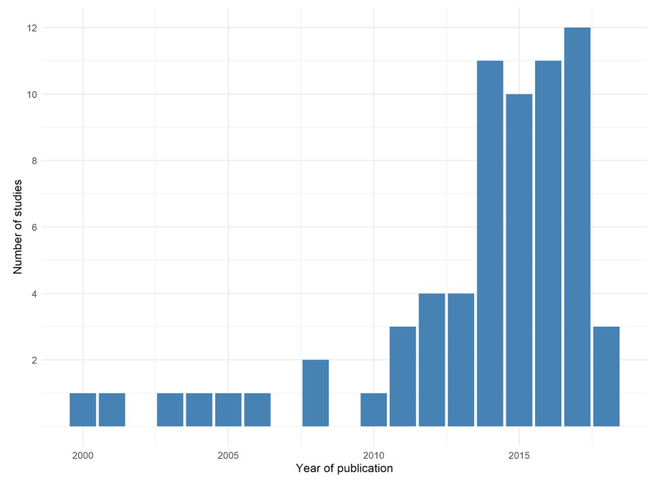

```{r setup, include=FALSE}
knitr::opts_chunk$set(echo = FALSE)
```

### Meta evaluations

[@yeyatiWhatWorksActive] undertake a meta-evaluation of active labour market policies  where RCTs were the only evaluation method/experimental design.  They note that RCTs in ALMP evaluations have exploded since 2014. [@cardWhatWorksMeta2015] report that roughly 10% of ALMP evaluations used RCTs - by 2019 that number was 20% and rising.



### Access to services

[@katzWhySectoralEmployment2020] evaluate the impact of sector-based labour market programs in four different randomized trials (where access to the program was randomized) in three different US areas (NYC, Tulsa, Northeast Ohio)

- WorkAdvance model:

  -- Per Scholas (NYC) - IT sector
  
  -- Towards Employment (NE Ohio) health care sector and manufacturing
  
  -- Madison strategies (Tulsa, Oklahoma), transportation and manufacturing
  

Outcomes mostly looking at earnings and attachment.

[@cheungDoesJobSearch2019] randomize access to the delivery of job search assistance at different service delivery sites in Sweden to show the impact of job search assistance alone.  Many studies have trouble detecting the impact of just job search assistance vs other components like training (doubling caseworker meeting frequency was the program) 

### Program components

[@belotProvidingAdviceJobseekers2019] also show that randomization within components of service is useful.  They randomize Scottish clients use of a digital job search tool which expands the occupations and structure of job search to demonstrate increasing job search effort / intensity / matching and payoff. [@brisceseImprovingJobSearch2020] do something very similar in Australia using the jobactive program; they randomize the use of standardized templates for resume and cover letters which demonstrate that the use of these tools improve job search success.  Finally, from the University of Alberta, [@wheelerLinkedinJobOpportunities2019] undertake a similar RCT in large South African cities; randomizing access to LinkedIn and measuring the effect on job search outcomes and informational frictions.


[@bolhaarCaseworkerDiscretionEffectiveness2018] use a clever RCT design to randomize how caseworkers assign social assistance recipients to different types of interventions, demonstrating, among other things, that more outcomes are captured if less discretion is extended to caseworkers in the Netherlands.
